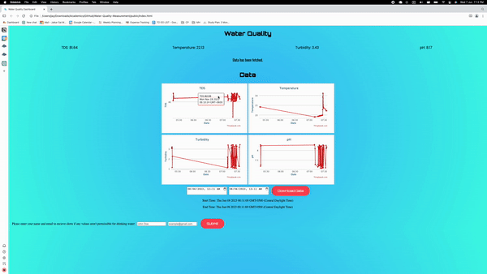

# Water-Quality-Measurement

This project was made for EC3.202 Embedded Systems Workshop Monsoon '22 course.
Its aim is to track several water quality values such as TDS, pH, turbidity etc, and act accordingly based on values such as sending an email. The dashboard allows for downloading values for a given timeframe, subscribing to water quality alerts, and shows the graphs of the values as well.

Details

- ESP32 was used
- Created using Express and Node
- Nodemailer was used to send emails
- Project mail is strawberry.kiwimoment@gmail.com
- [Thingspeak Channel](https://thingspeak.com/channels/1904915)
- [Website](https://water-quality-measurement-production.up.railway.app/) hosted on railway.app
- email subscription doesn't work for global website, but works on localhost
- [OM2M Server](https://esw-onem2m.iiit.ac.in/webpage/welcome/index.html?context=/~&cseId=in-cse), If it is still online, login is esw_guest:esw_guest
- Run `npm start` and view [localhost](http://127.0.0.1:5000/)
